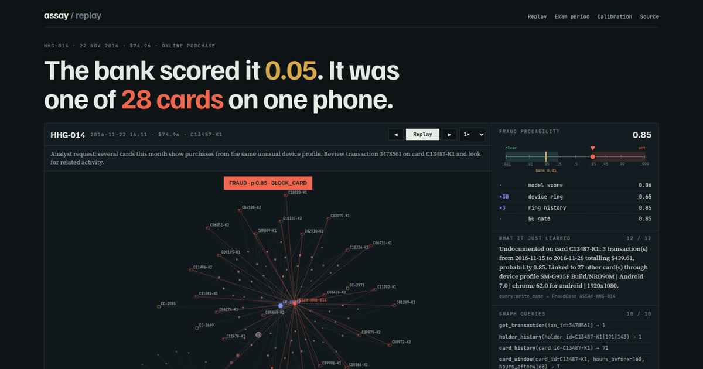

# assay

[](https://github.com/nikhilcherry/assay/actions/workflows/tests.yml)

**An agentic fraud investigator on TigerGraph, whose probabilities are measured, not guessed.**
Hacker House Goa 2026, Task 4 (TigerGraph x IEEE-CIS).

An alert goes in. A case file comes out: verdict, calibrated fraud probability,
pattern, affected transactions, connected cards, exposure, evidence with the
graph query behind every claim, a SAR when the policy calls for one, and the
next best action before and after the evidence the agent asked for.

[](https://nikhilcherry.github.io/assay/)

> **Watch it think: [nikhilcherry.github.io/assay](https://nikhilcherry.github.io/assay/)**. Every
> investigation replayed query by query: the graph grows as each query returns, and each
> likelihood ratio visibly moves the probability. New to fraud? Start with the
> [90-second story](https://nikhilcherry.github.io/assay/#story). Demo video (3:02):
> [`demo.mp4`](https://github.com/nikhilcherry/assay/releases/download/replay-v1/demo.mp4).

- **20 answer files**: [`cases/`](cases/)
- **60 investigations the agent started unprompted** (the optional monitor): [`monitor/`](monitor/)
- **How it works**: [`docs/ARCHITECTURE.md`](docs/ARCHITECTURE.md)
- **Write-up**: [`docs/BLOG.md`](docs/BLOG.md)

## The one idea

The closed-case file names **14,055 confirmed-fraud transactions between July and
October: 3.4% of the 417,404 in that period.** That is the whole fraud rate of the
underlying IEEE-CIS data. So a July–October transaction that no closed case names
is, to a very good approximation, legitimate, and the bank's history is a complete
labelled training set, not just a memory to retrieve from.

`assay` trains a transaction model on it, and only on it. The original Kaggle
labels are never read. The model is validated out of time: trained July to
September, scored on October, which it never saw.

| October, held out | AUC | Average precision |
|---|---|---|
| The bank's `risk_score` | 0.866 | 0.252 |
| **assay's model** | **0.964** | **0.638** |

Then it is calibrated, because the brief scores `fraud_probability` for
calibration. Here is the reliability table on the held-out month, with the
isotonic map cross-fitted so it is not grading itself:

| predicted | n | mean predicted | observed fraud rate |
|---|---|---|---|
| ≤ 0.05 | 91,067 | 0.005 | 0.005 |
| 0.05–0.15 | 4,951 | 0.079 | 0.082 |
| 0.15–0.30 | 990 | 0.201 | 0.212 |
| 0.30–0.50 | 730 | 0.411 | 0.389 |
| 0.50–0.70 | 659 | 0.638 | 0.645 |
| 0.70–0.85 | 2,009 | 0.771 | 0.768 |

When a case file here says 0.30, it means about three in ten.
([`docs/MODEL_REPORT.json`](docs/MODEL_REPORT.json))

## Results on the 20 cases

| Case (click to replay) | Verdict | p | Pattern | Exposure | SAR | Evidence requests | Final actions |
|---|---|---|---|---|---|---|---|
| [HHG-001](https://nikhilcherry.github.io/assay/#HHG-001) | legitimate | 0.03 | none | $0.00 | no | 1 | CLOSE_NO_FRAUD, CREATE_CASE |
| [HHG-002](https://nikhilcherry.github.io/assay/#HHG-002) | uncertain | 0.55 | card_not_present_fraud | $292.36 | no | 1 | MONITOR_CARD, DECLINE_TRANSACTION, CREATE_CASE |
| [HHG-003](https://nikhilcherry.github.io/assay/#HHG-003) | fraud | 0.85 | out_of_region_use | $165.93 | no | 0 | BLOCK_CARD, CREATE_CASE |
| [HHG-004](https://nikhilcherry.github.io/assay/#HHG-004) | uncertain | 0.52 | card_not_present_new_device | $128.33 | no | 1 | STEP_UP_AUTH, VERIFY_WITH_CUSTOMER, CREATE_CASE, ESCALATE_TO_ANALYST |
| [HHG-005](https://nikhilcherry.github.io/assay/#HHG-005) | legitimate | 0.03 | none | $0.00 | no | 0 | ALLOW_TRANSACTION, CLOSE_NO_FRAUD |
| [HHG-006](https://nikhilcherry.github.io/assay/#HHG-006) | fraud | 0.99 | undocumented | $1,906.07 | yes | 0 | BLOCK_CARD, CREATE_CASE, FILE_REPORT, ESCALATE_TO_ANALYST |
| [HHG-007](https://nikhilcherry.github.io/assay/#HHG-007) | fraud | 0.97 | account_takeover | $148.89 | no | 1 | BLOCK_CARD, CREATE_CASE |
| [HHG-008](https://nikhilcherry.github.io/assay/#HHG-008) | fraud | 0.99 | card_not_present_fraud | $111.28 | no | 0 | BLOCK_CARD, CREATE_CASE |
| [HHG-009](https://nikhilcherry.github.io/assay/#HHG-009) | fraud | 0.99 | card_not_present_fraud | $30.02 | no | 0 | BLOCK_CARD, CREATE_CASE |
| [HHG-010](https://nikhilcherry.github.io/assay/#HHG-010) | legitimate | 0.01 | none | $0.00 | no | 1 | CLOSE_NO_FRAUD, CREATE_CASE |
| [HHG-011](https://nikhilcherry.github.io/assay/#HHG-011) | fraud | 0.65 | card_not_present_new_device | $131.30 | no | 0 | BLOCK_CARD, CREATE_CASE |
| [HHG-012](https://nikhilcherry.github.io/assay/#HHG-012) | legitimate | 0.02 | none | $0.00 | no | 0 | ALLOW_TRANSACTION, CLOSE_NO_FRAUD |
| [HHG-013](https://nikhilcherry.github.io/assay/#HHG-013) | legitimate | 0.02 | none | $0.00 | no | 0 | ALLOW_TRANSACTION, CLOSE_NO_FRAUD |
| [HHG-014](https://nikhilcherry.github.io/assay/#HHG-014) | fraud | 0.85 | undocumented | $439.61 | yes | 0 | BLOCK_CARD, CREATE_CASE, MONITOR_CONNECTED_CARDS, FILE_REPORT, ESCALATE_TO_ANALYST |
| [HHG-015](https://nikhilcherry.github.io/assay/#HHG-015) | legitimate | 0.01 | none | $0.00 | no | 1 | CLOSE_NO_FRAUD, CREATE_CASE |
| [HHG-016](https://nikhilcherry.github.io/assay/#HHG-016) | fraud | 0.98 | card_not_present_new_device | $59.67 | no | 0 | BLOCK_CARD, CREATE_CASE |
| [HHG-017](https://nikhilcherry.github.io/assay/#HHG-017) | legitimate | 0.14 | none | $0.00 | no | 0 | ALLOW_TRANSACTION, CLOSE_NO_FRAUD |
| [HHG-018](https://nikhilcherry.github.io/assay/#HHG-018) | fraud | 0.98 | account_takeover | $156.15 | no | 0 | BLOCK_CARD, CREATE_CASE |
| [HHG-019](https://nikhilcherry.github.io/assay/#HHG-019) | fraud | 0.95 | card_not_present_new_device | $99.92 | no | 1 | BLOCK_CARD, CREATE_CASE |
| [HHG-020](https://nikhilcherry.github.io/assay/#HHG-020) | legitimate | 0.01 | none | $0.00 | no | 0 | ALLOW_TRANSACTION, CLOSE_NO_FRAUD |

10 fraud, 8 legitimate, 2 uncertain. Eight alerts carried a bank risk score of
0.52 or more and closed as legitimate. The brief says half the cases are
legitimate and that blocking everything scores badly. This agent blocks 10 cards
and holds 2 for a human.

**What a dispute is worth, measured.** An earlier version cleared three customer
disputes (HHG-003, HHG-004, HHG-011) because the model scored them low, and it
simulated the customer taking the dispute back. The bank's own October says
otherwise: all 1,203 disputes it investigated were fraud, and 15% of them scored
under 0.05. A low score does not clear a denial. But the brief says half the exam
cases are legitimate, so some disputes may be planted on legitimate transactions,
and for those the score *is* informative: under 0.005 it is 14 times more common
on a legitimate transaction than on disputed fraud. assay now averages the two
readings, weighted equally, and says so
([`assay/disputes.py`](assay/disputes.py), [`docs/DISPUTE_REPORT.json`](docs/DISPUTE_REPORT.json)).
HHG-003 moves to fraud at 0.85, HHG-011 to fraud at 0.65, and HHG-004 (0.52) is
escalated rather than guessed. Only a recurring-charge match (R7) now overturns a
denial.

## Two patterns the documented five do not cover

**HHG-014: a device ring.** One handset profile (Samsung SM-G935F, Android 7.0,
Chrome 62, 1920x1080), behind an anonymous proxy and marked *New* on every card
it touches, placed 60 purchases on **28 unrelated cards** in November and
December. Every one scored low on the bank's model (the flagged one: 0.05). No
single card looks wrong: the fraud is only visible as a *shape in the graph*, the
traversal from the flagged transaction's device to every other card that used it.
The same profile appears in four closed cases from August and September that the
bank's analysts could not match to a typology (CC-2649, CC-2971, CC-2985, CC-3035).
R6 + R9: case, report, and monitoring for all 27 connected cards.

What makes it a ring and not a popular phone was measured: of 205 specific
device profiles seen on five or more cards in July to October, **exactly one**
is also marked New and proxied on at least 90% of uses. Drop the proxy clause
and 13 qualify, and their transactions are 1.5% fraud, which is just popular handsets.

**HHG-006: amount structuring.** Four online purchases in 30 minutes, $456.96
to $488.04, each just under $500, from two devices both marked New. The customer
reported one of them. Five closed cases record the identical shape (CC-3748,
CC-3841, CC-3907, CC-4086, CC-4124). Measured on July–October, bursts like this
are fraud 9 times in 41, a likelihood ratio of about 8, and the agent applies
exactly that, not a guess. Exposure $1,906.07, so a SAR is filed under §3a on
exposure alone.

## How an investigation runs

```
alert ─► get_transaction ─► holder_history / card_history ─► card_window(±7d)
            │                         baseline: amounts, regions, devices
            ▼
   detectors: structuring · device ring · card testing · recurring charge (R7)
            │   each Finding = claim + the query that produced it + entity IDs
            ▼
   p = calibrated model score  ×  likelihood ratios of the findings (log-odds)
            ▼
   §6 gate ── stop (≥0.85 / ≤0.15 on two independent pieces)
         └── request evidence ─► simulated reply ─► p updated
            ▼
   policy.decide() before and after ─► initial / final actions, routes, rules
            ▼
   episode (same card, ±24h, p≥0.30), connected cards, exposure, SAR
            ▼
   FraudCase vertex written to TigerGraph ─► next investigation retrieves it
```

- **No language model produces a number, an ID, an action or a route.** Policy
  v1.0 is code ([`assay/policy.py`](assay/policy.py)) with 50 tests, most of
  them negatives: R1 must *not* block on one signal, R7 beats R2 on a recurring
  charge, R10 refuses on one compromised card, an uncertain verdict never files a report.
- **Every evidence claim cites its query**, e.g.
  `query:device_neighbors(device_profile=SM-G935F ..., days=30)`, plus the
  policy text and pattern definition it rests on (`source: document`).
- **The episode builder was tuned on the bank's own October cases**, out of
  time. "Same card, ±24h, p ≥ 0.30" reproduces the closed cases' transaction
  lists at Jaccard 0.80.
- **The pattern** for known typologies comes from a classifier trained on the
  4,640 labelled closed cases (5-fold CV accuracy 0.81). Card testing and the
  two undocumented patterns come from explicit sequence rules, because they are
  properties of several transactions, not of one.
- **Uncertainty is allowed to stay uncertain.** HHG-002 sits at 0.55. Rather than
  simulate a decisive customer reply in whichever direction a coin would land,
  the agent assumes no reply, applies R4, and leaves the case open.

## TigerGraph

Schema in [`graph/schema.gsql`](graph/schema.gsql): Customer, Card, **Holder**,
Txn, DeviceProfile, EmailDomain, BillingRegion, ClosedCase, **FraudCase**, and
16 edge types, loaded with a GSQL loading job
([`graph/load.gsql`](graph/load.gsql)): 590,742 transactions, 222,437 holders,
9,705 device profiles, 5,565 closed cases.

- **Holder.** `customer_id` is the issuer field `card1`, a bucket that can hold
  ten thousand transactions across dozens of regions. A Holder is card + billing
  region + the account-open day implied by `D1`, and it is the level at which
  "is this normal for them?" means anything. Investigations fall back to the
  card when a holder has fewer than five prior transactions, and say so.
- **FraudCase is separate from ClosedCase.** The bank's cases are the training
  labels; the agent's own cases are new memory. Keeping the types apart keeps
  the agent's writes out of its own calibration set.
- **The 10 installed queries are the agent's tools**
  ([`graph/queries/investigation.gsql`](graph/queries/investigation.gsql)):
  `get_transaction`, `card_window`, `card_history`, `holder_history`,
  `device_neighbors`, `closed_cases_for_card`, `closed_cases_by_device`,
  `closed_cases_touching`, `similar_prior_cases`, `prior_fraud_cases`.
- **Case memory is causal.** Alerts are investigated in the order they were
  opened; each finished case is upserted as a FraudCase with edges to its card,
  the transactions it cites, the devices it implicates and the closed cases it
  drew on; `prior_fraud_cases` is how the next investigation finds it.

`assay/store.py` has a pandas implementation of the same ten queries, used by
the tests and the monitor. Both backends produce identical decisions, IDs and
amounts on all 20 cases; the only difference is the order of tied similar cases.

## The monitor (optional, Innovation)

[`assay/monitor.py`](assay/monitor.py) watches November and December on its own
and raised 60 alerts that nobody asked for, investigated with the same agent,
in [`monitor/`](monitor/):

| source | what it looks for | alerts | outcome |
|---|---|---|---|
| ring scan | a specific device profile on ≥5 cards, New and proxied on ≥90% of uses | 27 | 27 fraud, $8,429 |
| structure scan | ≥3 online purchases of $400–$500 on one card within an hour | 19 | 4 fraud, 15 legitimate |
| model monitor | assay p ≥ 0.70 where the bank's risk score was < 0.30 | 14 | 14 fraud, $5,638 |

It deliberately does not re-raise what the bank's risk score already flags;
those alerts exist without it. Fifteen of the nineteen structure alerts were
cleared as legitimate, because the scan is a reason to look, not a verdict: in
July–October only 9 of 45 such bursts were fraud, and on top of the model the
shape is worth ×1.64 ([`docs/LR_REPORT.json`](docs/LR_REPORT.json)).

**A finding about the data itself.** Twelve of the nineteen bursts in the exam
period, and HHG-006, are four purchases whose timestamps all fall on a whole
minute, the first exactly on the hour: rows added to the dataset to seed the
exercise (by chance, four whole-minute timestamps is about 1 in 13 million).
The same planted shape appears ten times in September–October, and the bank
confirmed **five** of them as fraud and cleared five. So the planted bursts are
decoys as often as they are fraud, and the timestamp marks an exercise, not a
verdict. assay does not use it as evidence: it is an artifact of how the
dataset was built, not something fraud looks like at a bank.

## What is assumed, stated plainly

- **Customer and analyst replies are simulated** (the brief allows it). The
  rule: at p ≥ 0.6 the cardholder denies, at p ≤ 0.4 they confirm, and in
  between they do not reply (R4). A customer's own dispute is a denial (R2):
  the agent never simulates a disputing customer changing their mind, except on
  a recurring-charge match (R7).
- **Likelihood ratios are measured on top of the model**, on scores from a
  model that never saw the month it is scoring ([`assay/crossfit.py`](assay/crossfit.py),
  [`assay/measure.py`](assay/measure.py)): structuring ×1.64 (95% CI 0.45–4.47),
  card testing ×2.07 (0.33–15.18), case memory ×1.11. An earlier version used
  raw lifts (×8, ×20, ×3) that double-counted what the model already sees.
  Customer disputes are measured too; the one assumption there is the equal
  weight between "real dispute" and "planted dispute".
- **Still assumptions, and why:** the device ring ×30 and its closed-case
  history ×3. There is one ring in the history, spanning August and September,
  so a model held out on one month has learned the ring from the other, and the
  bank named only 10 of its 54 transactions: the attempted measurement
  (×0.56) is in the report and is not trustworthy either way. Also a
  simulated denial ×8, a confirmation ÷15, and a recurring-charge match ×0.1
  (no cleared dispute exists in the history to measure it on).
- **Card IDs are derived.** Transactions carry no card column. Within a
  customer, a card is a distinct `card6`, numbered from least to most used. The
  rule reproduces 99.2% of the 14,975 card IDs the closed cases name, and all 20
  in the case pack; where a closed case names a card, that label wins.
- **`tokens` is 0.** No LLM is on the decision path. Summaries and SAR
  narratives are generated from the evidence ledger, so every figure in them is
  one the ledger holds.

## The replay

[`site/`](site/) is a static page that replays all 80 investigations (20 exam cases
and 60 monitor cases) from traces of real runs. [`assay/trace.py`](assay/trace.py) reruns the
same `Investigator` against a store that records what each query returned. It writes
three things per investigation. The first is every query in order, with the vertices
it returned, so the replay draws exactly the graph the agent saw. The second is the
probability ledger: the calibrated model score, then each likelihood ratio applied in
log-odds, then the §6 gate and the evidence reply. The third is the answer file
itself. The trace step fails if any verdict, probability, pattern, exposure or
connected card differs from `cases/` or `monitor/`. [`tests/test_trace.py`](tests/test_trace.py)
checks this in CI, along with two other properties: every ledger adds up to the final
probability, and every graph claim in an answer file cites a query that appears in
the trace.

The page has no build step and no framework. It is one HTML file with a hand-written
force layout on canvas. [`scripts/record_demo.py`](scripts/record_demo.py) drives it
headlessly and records the demo video from the DevTools screencast, so the video is
reproducible too.

## Reproduce

Needs Python 3.12, Docker, and the four dataset files in `data/`.

```bash
uv venv .venv --python 3.12 && uv pip install --python .venv/bin/python -r requirements.txt
export PYTHONPATH=.
python -m assay.data                  # stage CSVs to parquet, derive card IDs          (~40 s)
python -m assay.model                 # train + validate + calibrate                    (~5 min)
python -m assay.patterns              # pattern classifier                              (~30 s)
python -m assay.disputes              # what a dispute is worth  -> docs/DISPUTE_REPORT.json

docker run -d --name assay-tg --ulimit nofile=1000000:1000000 -p 14240:14240 \
  -v "$PWD/data:/home/tigergraph/data:ro" -t tigergraph/community:4.2.5
python -m assay.tg prepare            # loading CSVs
python -m assay.tg setup              # schema, load, install queries                  (~6 min)

python -m assay.run                   # the 20 cases, on TigerGraph  -> cases/
python -m assay.run --local           # same, on the pandas reference store
python -m assay.monitor               # the autonomous sweep         -> monitor/
python -m assay.trace                 # replay traces                -> site/data/     (~3 min)
python -m pytest -q                   # 427 tests

python -m http.server 8731 -d site    # the replay, at localhost:8731
python scripts/record_demo.py         # the demo video               -> docs/demo.mp4  (needs playwright)
```

## Layout

```
assay/        data.py (staging, card IDs, holders)   model.py (calibrated model)
              patterns.py   detectors.py   policy.py   documents.py
              investigate.py (the agent)   store.py / tg.py (the two backends)
              disputes.py (measured dispute evidence)
              run.py   monitor.py   validate.py   trace.py (replay traces)
graph/        schema.gsql   load.gsql   queries/investigation.gsql
cases/        the 20 answer files
monitor/      the autonomous monitor's alerts and investigations
docs/         BRIEF.md (organizer brief)   ARCHITECTURE.md   MODEL_REPORT.json   BLOG.md
site/         the replay: index.html + data/ (one trace per investigation)
scripts/      record_demo.py
tests/        policy, detectors, disputes, answer files, replay traces
```

Data: IEEE-CIS Fraud Detection dataset, Vesta Corporation, via the IEEE
Computational Intelligence Society; customers, calendar, channel, risk scores,
closed cases and case pack added by TigerGraph for Hacker House Goa 2026. The
dataset is not redistributed here. `site/data/` holds only the rows the agent's own
queries returned for these 80 investigations (4,159 of 590,742 transactions), with
the fields the replay draws.
